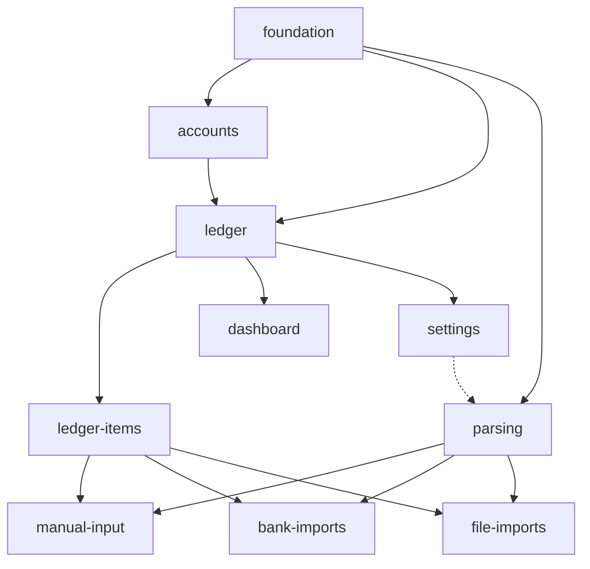

# MVP Capability Plan — Finup v1

Canonical delivery plan for the Finup MVP. It is the single place that assigns
**one owner per MVP functional requirement**, fixes the **critical-path order**,
states what is **in / out of scope** for v1, defines the **Definition of Done**
each capability slice must meet, and records the **human sign-off**.

Source of truth chain: [requirements.md](requirements.md) (FR/NFR/TC/BC IDs) →
this plan (ownership + order) → `openspec/specs/<capability>/spec.md` (behavior) →
tests (`@trace FR-*`) → recordings (`docs/qa/`). Capability boundaries and the
dependency rationale live in [capabilities.md](capabilities.md); this plan does
not restate them, it operationalizes them. `scripts/check-traceability.mjs`
enforces that every MVP FR below is owned here.

> **Status:** approved 2026-06-28 by Andriy (product owner + tech lead) — see
> [§7](#7-sign-off). Note: `gate:status` still prints `needs sign-off` for G3 by
> design (it checks file presence only; the sign-off is the human record below).

---

## 1. Ownership matrix — one owner per MVP FR

Every MVP FR has exactly **one owning capability** accountable for its delivery
(spec scenario, implementation, tests, recording). "Depends on" lists capabilities
whose output the owner consumes; it does not transfer ownership. Schema and
cross-cutting code are owned by `foundation` (TC-MOD-02) regardless of who reads
them.

### foundation (Epic 0) — shell, schema, contracts

| FR | Owner | Depends on | Done signal |
|----|-------|-----------|-------------|
| FR-SHELL-01 | foundation | — | Installable PWA shell; nav to Dashboard/Ledger/Imports/Accounts/Settings |
| FR-SHELL-02 | foundation | — | Desktop sidebar/topbar + mobile/PWA nav with safe-area |
| FR-SHELL-03 | foundation | — | Empty/loading/partial/offline/unsupported/error states exist on every screen |
| FR-SHELL-04 | foundation | — | Shell, globals, `fin-*` tokens owned solely by foundation |
| FR-IMPORT-01 | foundation | — | `/imports` hub links text, files, bank channels |
| FR-IMPORT-02 | foundation | manual-input, bank-imports, file-imports | Each channel stores the `input_event` before normalize/parse |

### accounts (Epic 6) — account metadata, default, CRUD/archive

| FR | Owner | Depends on | Done signal |
|----|-------|-----------|-------------|
| FR-ACCT-01 | accounts | foundation | List accounts; exactly one default maintained |
| FR-ACCT-02 | accounts | ledger | Each account shows balance from non-deleted items (via ledger queries) |
| FR-ACCT-03 | accounts | foundation | UAH-only account metadata is editable |
| FR-ACCT-04 | accounts | foundation | Create accounts + switch default; one default invariant holds |
| FR-ACCT-05 | accounts | ledger-items | Delete = soft archive; items retained; cannot archive default/last active |
| FR-ACCT-06 | accounts | foundation | Seeded `Готівка` UAH default at bootstrap; no stored opening balance |

### ledger (Epic 7) — balance & aggregate queries

| FR | Owner | Depends on | Done signal |
|----|-------|-----------|-------------|
| FR-LEDGER-01 | ledger | foundation | `ledger_item` is the atomic row; no transaction/posting entity |
| FR-LEDGER-02 | ledger | foundation | `pending`+`approved` count toward balance; `deleted` excluded |
| FR-LEDGER-03 | ledger | foundation | Per-account and overall balance queries over non-deleted items |
| FR-LEDGER-04 | ledger | foundation | Income/expense aggregate queries over non-deleted items |
| FR-LEDGER-05 | ledger | foundation | Items are the single balance source; no independent balance store |

### ledger-items (Epic 1) — review/write + category text

| FR | Owner | Depends on | Done signal |
|----|-------|-----------|-------------|
| FR-ITEM-01 | ledger-items | ledger | List items with status; newest-first by `occurred_at`; incremental pagination |
| FR-ITEM-02 | ledger-items | ledger | Filter by status/type/account/category/date-range + text search on description |
| FR-ITEM-03 | ledger-items | foundation | Edit all fields of pending/approved; editing approved keeps it approved; `occurred_at` mandatory |
| FR-ITEM-04 | ledger-items | foundation, parsing | Approve pending → approved; partial-success batch creation of pending items |
| FR-ITEM-05 | ledger-items | ledger | Delete → `deleted`; excluded from balances; kept as log |
| FR-ITEM-06 | ledger-items | accounts, foundation | Missing `account_id` resolves to default before save |
| FR-ITEM-07 | ledger-items | parsing | Failed parse retryable from `input_event`; deleted items don't block re-entry |
| FR-CAT-01 | ledger-items | foundation | `category` is required free text on the item; no category table |
| FR-CAT-02 | ledger-items | parsing | AI category text stored as-is on the item |
| FR-CAT-03 | ledger-items | foundation | Missing category defaults to `Без категорії` |
| FR-CAT-04 | ledger-items | ledger | Category breakdown groups by raw category text, no join |

### parsing (Epic 5) — parser port, OpenAI adapter, runs

| FR | Owner | Depends on | Done signal |
|----|-------|-----------|-------------|
| FR-PARSE-01 | parsing | foundation | Consumes normalized `InputEvent` → `ParsingResult` of drafts |
| FR-PARSE-02 | parsing | foundation | Drafts carry description, signed amount, type, date-when-known, sourceRef |
| FR-PARSE-03 | parsing | foundation | Category returned as-is; none → `Без категорії` downstream |
| FR-PARSE-04 | parsing | foundation | Confidence in `[0,1]` persisted when available; not shown in v1 UI |
| FR-PARSE-05 | parsing | foundation | Deterministic keyless privacy/noise normalization before AI |
| FR-PARSE-06 | parsing | settings | OpenAI v1 adapter behind an adapter boundary for a future local LLM |
| FR-PARSE-07 | parsing | foundation | Parser writes no items; returns drafts through its port only |
| FR-PARSE-08 | parsing | foundation | Every attempt recorded as `parser_run` (success/failed, payload, result/error, retry) |

### manual-input (Epic 2) — `/imports/text`

| FR | Owner | Depends on | Done signal |
|----|-------|-----------|-------------|
| FR-TEXT-01 | manual-input | foundation | Free-form text submitted on `/imports/text` |
| FR-TEXT-02 | manual-input | foundation | Stored as `input_event` source `text` before processing |
| FR-TEXT-03 | manual-input | parsing | Source-normalized text passed to parser; failure shows error + retry |
| FR-TEXT-04 | manual-input | ledger-items | Drafts → pending items via item-creation contract (partial-success) |
| FR-TEXT-05 | manual-input | ledger-items | Auto-redirect to Ledger with created/failed summary |

### bank-imports (Epic 3) — `/imports/bank`

| FR | Owner | Depends on | Done signal |
|----|-------|-----------|-------------|
| FR-BANK-01 | bank-imports | foundation | Upload CSV/XLS/XLSX (mime-validated, no hard size limit) → `input_event` |
| FR-BANK-02 | bank-imports | foundation | Provider (`monobank`/`privatbank`) chosen and recorded on the event |
| FR-BANK-03 | bank-imports | — | Deterministic provider normalization: clean rows + source row numbers; no items |
| FR-BANK-04 | bank-imports | parsing, ledger-items | ≤1 item per source row; one pending item per parsed row (partial-success) |
| FR-BANK-05 | bank-imports | ledger-items | No preview gate; auto-redirect to Ledger with summary for later review |
| FR-BANK-06 | bank-imports | foundation | `(input_event_id, import_row_number)` unique; retry = insert-if-absent (skip existing) |

### file-imports (Epic 4) — `/imports/files`

| FR | Owner | Depends on | Done signal |
|----|-------|-----------|-------------|
| FR-FILE-01 | file-imports | foundation | Upload one receipt photo (image mime-validated, no hard size limit) |
| FR-FILE-02 | file-imports | foundation | Original ref stored as `input_event` source `photo` with `storage_uri`+`mime_type` |
| FR-FILE-03 | file-imports | — | Deterministic non-AI preprocessing before AI; original ref preserved |
| FR-FILE-04 | file-imports | parsing | AI vision parse on preprocessed payload; failure shows error + retry |
| FR-FILE-05 | file-imports | ledger-items | Drafts → pending items (partial-success); auto-redirect to Ledger with summary |

### dashboard (Epic 8) — read-only overview

| FR | Owner | Depends on | Done signal |
|----|-------|-----------|-------------|
| FR-DASH-01 | dashboard | ledger | Balance summary from non-deleted items (all-time) |
| FR-DASH-02 | dashboard | ledger | Income/expense totals from non-deleted items |
| FR-DASH-03 | dashboard | ledger | Category breakdown by raw category text incl. `Без категорії` |
| FR-DASH-04 | dashboard | ledger | Monthly trends (all-time); shown when ≥2 distinct months, else explicit empty state |
| FR-DASH-05 | dashboard | — | Read-only; never mutates items/imports/accounts |

### settings (Epic 9) — config + export

| FR | Owner | Depends on | Done signal |
|----|-------|-----------|-------------|
| FR-SET-01 | settings | foundation | Technical config screen scoped to AI provider + data export |
| FR-SET-02 | settings | parsing | AI key stored in DB, edited here, write-only over the wire |
| FR-SET-03 | settings | ledger | Export ledger items to CSV; no destructive reset in v1 |

> **Cross-cutting constraints** (not MVP FRs, owned where the work lands):
> NFR-PRIV-01/02 → `parsing` + `foundation`; NFR-COST-01 → `parsing`/`settings`;
> NFR-OBS-01, NFR-DX-01, NFR-A11Y-01, NFR-I18N-01 → every capability at its DoD;
> TC-STACK-*/TC-PURE-01/TC-DATA-01/TC-MOD-01/TC-MOD-02/TC-UI-01 → `foundation`
> owns shared code/schema, each capability complies within its module.

---

## 2. Critical-path DAG

> Solid edges are hard dependencies; the dashed edge (`settings -.-> parsing`) is
> the soft link — `parsing` ships a working default OpenAI config and `settings`
> only edits it later (FR-SET-02). `accounts` owns the balance view (FR-ACCT-02)
> but consumes `ledger` queries, hence `accounts --> ledger`. `ledger --> settings`
> reflects the CSV export reading ledger items (FR-SET-03).

Hard ordering constraints (from [capabilities.md](capabilities.md#dependency-graph)):

1. **Everything after `foundation`** — it owns the shell, DB boundary, domain
   contracts, the `ledger_items`/`input_events`/`parser_runs` schema, and the
   item-creation contract (TC-MOD-02).
2. **`accounts` (default) before item writes** — a default account must exist
   before any item is saved (FR-ITEM-06, FR-ACCT-01, FR-ACCT-06 seed).
3. **`ledger` before any balance display** — balances read non-deleted items and
   are the single source of truth (FR-ACCT-02, FR-DASH-*, FR-LEDGER-05).
4. **`parsing` + `ledger-items` before the three channels** — the parser never
   writes; channels create via the item-creation contract (FR-PARSE-07).
5. **`dashboard` after `ledger`** — read-only over queries (FR-DASH-05).
6. **`settings` is a soft dependency of `parsing`** — `parsing` ships a working
   default OpenAI config; `settings` only edits it later (FR-SET-02).

---

## 3. Phased delivery order

One OpenSpec change per capability (split if a change exceeds reasonable review
size). Sequence and rationale per phase are in
[capabilities.md §Implementation order](capabilities.md#implementation-order-phased).

| # | Phase | Slice (change) | Capability | Done |
|---|-------|----------------|------------|------|
| 1 | 1 Foundation | `add-foundation-shell` | foundation | ✅ shipped (archived) |
| 2 | 2 Core domain | `add-accounts` | accounts | ☐ |
| 3 | 2 Core domain | `add-ledger-queries` (+ FR-ACCT-02 balance view) | ledger | ☐ |
| 4 | 2 Core domain | `add-ledger-items-review` | ledger-items | ☐ |
| 5 | 3 Parsing | `add-parsing-pipeline` | parsing | ☐ |
| 6 | 4 Channels | `add-manual-text-input` | manual-input | ☐ |
| 7 | 4 Channels | `add-bank-statement-imports` | bank-imports | ☐ |
| 8 | 4 Channels | `add-receipt-photo-imports` | file-imports | ☐ |
| 9 | 5 Read/config | `add-dashboard` | dashboard | ☐ |
| 10 | 5 Read/config | `add-settings` | settings | ☐ |

> `add-accounts` now also covers the new FR-ACCT-04/05/06 (create, soft-archive,
> seeded default). `add-settings` now also covers FR-SET-03 (CSV export). These
> were added during the 2026-06-28 spec clarification pass.

---

## 4. Scope — in / out for v1

**In scope (v1):** everything in the ownership matrix above. Confirmed product
decisions that bind implementation (from the 2026-06-28 clarification pass):

- No stored opening balance; account balance derives only from non-deleted items
  (FR-ACCT-06, FR-LEDGER-05).
- Accounts support full CRUD + default switching; delete is a **soft archive**;
  the default and last-active account cannot be archived (FR-ACCT-04, FR-ACCT-05).
- Ledger list: newest-first by `occurred_at`, incremental pagination (~10/page),
  full filter set + description search (FR-ITEM-01, FR-ITEM-02).
- Editing keeps `approved` status; `occurred_at` is mandatory (defaults to entry
  time) (FR-ITEM-03).
- Multi-item creation is **partial-success** with a created/failed summary
  (FR-ITEM-04, FR-BANK-04, FR-FILE-05); every returned draft is attempted, only
  schema-invalid drafts fail; no confidence-threshold filtering (FR-PARSE-04).
- Imports auto-redirect to the Ledger with a summary; parse failures show an
  explicit error + retry, preserving the `input_event` and failed `parser_run`
  (FR-TEXT-05, FR-BANK-05, FR-FILE-05, FR-PARSE-08).
- Bank retry is **insert-if-absent** — rows that already produced an item (any
  status) are skipped (FR-BANK-06).
- File uploads are mime-validated with no hard size limit (FR-BANK-01, FR-FILE-01).
- AI key stored in DB, edited in Settings, write-only over the wire (FR-SET-02).
- Dashboard is all-time; monthly trends require ≥2 distinct months (FR-DASH-04).
- Settings = AI provider config + CSV export; **no destructive reset** (FR-SET-03).

**Out of scope (v1)** — see [requirements.md §Out of scope](requirements.md#out-of-scope-v1):
multi-user/roles/teams, multi-currency, PDF import, direct bank-API integration,
Telegram/Discord input, generic integration API, budgets/goals, and any
data-reset/clear action.

---

## 5. Definition of Done (per capability slice)

A slice is **Done** only when all of the following hold:

1. **Spec:** `openspec/specs/<capability>/spec.md` covers every owned FR; `npx
   openspec validate <capability> --type spec --strict` passes.
2. **Traceability:** every owned FR is cited in the spec and owned here; `npm run
   check:trace` reports `0 failure(s)`; the generated report is committed fresh.
3. **Tests-first:** unit/integration tests exist and carry `@trace FR-*` for each
   owned FR; tests were red before implementation, green after.
4. **Quality gates:** `npm run lint`, `npx tsc --noEmit`, `npm run test`, and
   `npm run build` all pass; runtime console is silent on a healthy session
   (NFR-OBS-01, NFR-DX-01).
5. **Boundaries:** only the owning module + its route subtree changed; shared
   shell/schema/contracts changed only via a Foundation/Coordination change
   (TC-MOD-01, TC-MOD-02).
6. **UX:** screens implement the six shared states and follow the calm
   Ukrainian-first design (FR-SHELL-03, BC-BRAND-01/02, NFR-I18N-01, NFR-A11Y-01).
7. **Evidence:** a recording manifest under `docs/qa/` references each owned FR;
   `docs/current-state.md` updated.
8. **Review:** passes the review-gate (correctness, security, spec-compliance) and
   any blocking findings resolved.

---

## 6. Open dependencies / blockers

- `@vitest/coverage-v8` is not installed → the coverage baseline (DoD item 4
  extension) is blocked until added as a dev dependency.
- Transitive PostCSS advisory via bundled Next.js (`GHSA-qx2v-qp2m-jg93`) — do not
  `npm audit fix --force`; track for a safe override before production.

---

## 7. Sign-off

This plan governs MVP delivery. Implementation of a slice should not begin until
the plan is signed off (gate G3).

| Role | Name | Decision | Date |
|------|------|----------|------|
| Product owner | Andriy | ☑ approved | 2026-06-28 |
| Tech lead | Andriy | ☑ approved | 2026-06-28 |

**Sign-off notes:** Approved after the pre-sign-off corrections (capabilities.md
synced with FR-ACCT-04/05/06 + FR-SET-03 and FR-ACCT-02 ownership; requirements.md
category heading fixed; DAG converted to Mermaid). All 10 specs validate strict;
traceability reports 0 failures over 60 MVP FRs.
